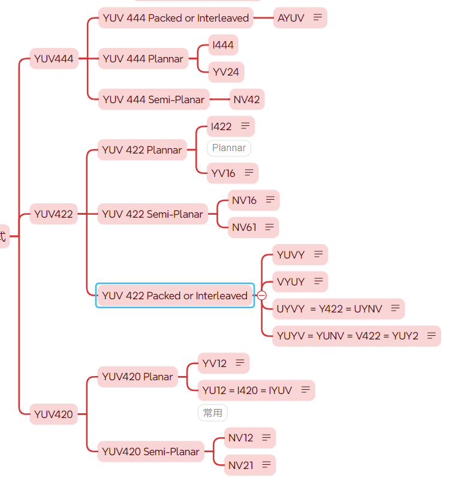

## 目录
*   [YUV](#yuv)
*   [分类方式]()
    *   [采样](#采样)
    *   [排序方式](#排序方式)
*   [常见格式]
    *   [I420](#i420采集)
*   [参考文章](#参考文章)

# YUV
按照Y、U、V分量比例可分为`4:4:4`、`4:2:2`、`4:2:0`三种常见的比例。根据分量排列方式又可继续划分为`Packed`、`Planar`、`Semi-Planar`. 

### 采样
-   4:4:4 1个Y分量使用一组UV分量
-   4:2:2 2个Y分量使用一组UV分量
-   4:2:0 4个Y分量使用一组UV分量

### 排序方式
-   Planar Y、U、V 三个分量独立存储
-   Semi-Planar Y分量单独存储, UV分量交错存储
-   Packed Y、U、V 三个分量交错存储

## 常见格式
-   ### I420采集
    > I420 = YU12 = IYUV 说的都是同一个东西  
    > 存储格式: Planar  
    > 各分量所占大小 W*H=Y; W*H/4=U; W*H/4=V;  
    > 分别存储Y U V分量，每四个Y分量共用一组UV分量

    内存中的存储方式
    ```
    Y Y Y Y Y Y
    Y Y Y Y Y Y
    Y Y Y Y Y Y
    Y Y Y Y Y Y
    Y Y Y Y Y Y
    Y Y Y Y Y Y
    u u u
    u u u
    u u u
    v v v
    v v v
    v v v
    ```

### 参考文章
[https://zhuanlan.zhihu.com/p/384455058](https://zhuanlan.zhihu.com/p/384455058)  
[https://paaatrick.com/2020-01-26-yuv-pixel-formats/](https://paaatrick.com/2020-01-26-yuv-pixel-formats/)