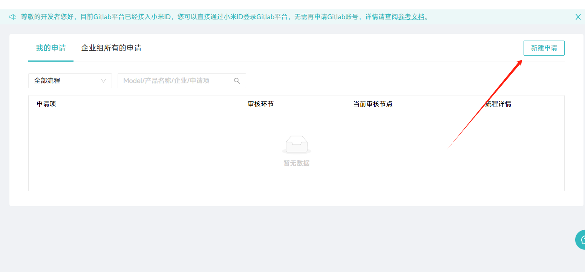
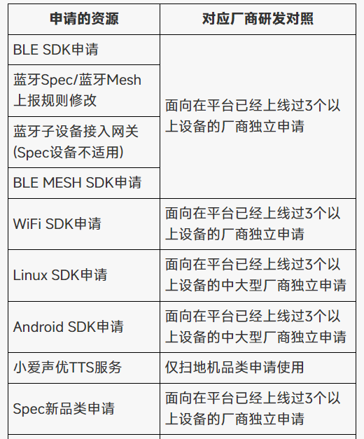
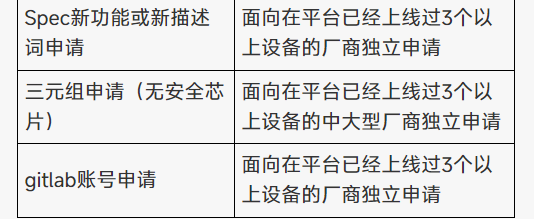

# 小米IOT WIFI SDK物料申请

## 第一步 注册账号
## 第二步 企业认证
## 第三步 开发团队能力验证

进入该 [链接](https://iot.mi.com/fe-op/manageCenter/projectApply/index) 点击新建申请,第一次会跳到问卷页面.填写完等审核即可.
`这块文档并未说明`

## 第四步 选择接入方案 
[链接](https://iot.mi.com/new/doc/getting-started/workflow)
由于我的业务需要调整通用模组与MCU通讯格式, 选 WIFI SDK二次开发方案
## 第五步 创建产品
[流程](https://iot.mi.com/v2/new/doc/quick-started/sdk-module)
## 第六步 采购模组
[模组页](https://iot.mi.com/moduleBrowser.html)
根据产品选择模组即可. 这里我选择ESP-WROOM32D
[创建模组申请页面 (企业用户可免费申请)](https://iot.mi.com/fe-op/manageCenter/purchase/module)
## 第七步 获得WIFI SDK
申请WIFI SDK权限 [页面](https://iot.mi.com/fe-op/manageCenter/projectApply/index)  
`注意:WIFI SDK申请有条件.`  

`笔者公司不够资格,到步就换反感了.`

## 参考
[文档1](https://iot.mi.com/new/doc/accesses/direct-access/embedded-development/wifi/sdk-dev/quickstart)  
[文档2](https://iot.mi.com/v2/new/doc/quick-started/sdk-module)