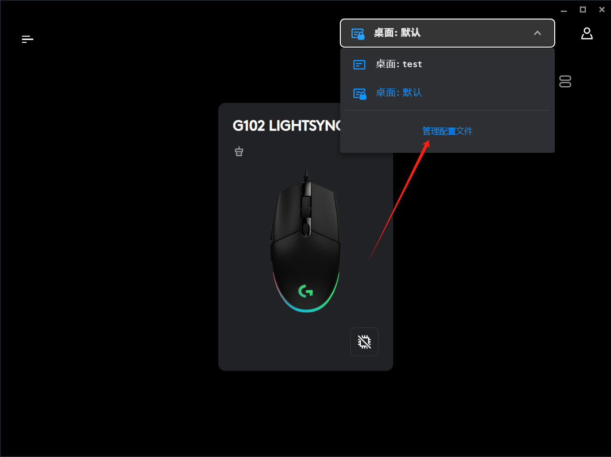
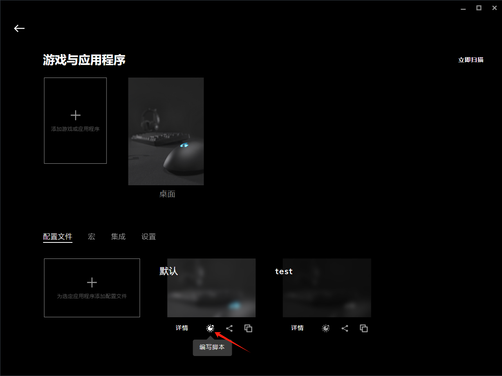

# 罗技鼠标宏

## 目录
- [罗技鼠标宏](#罗技鼠标宏)
  - [目录](#目录)
  - [前言](#前言)
  - [开始](#开始)
  - [认识鼠标按键](#认识鼠标按键)
  - [文档](#文档)

## 前言
在互联网大寒冬年代,大家都在为冰封前攒够储备粮. 我也不例外. 最近身边朋友对鼠标辅助有定制化需求,故我对这方面进行研究. 作为曾经的'网瘾少年'对其早有耳闻,但没想过除了内存挂和封包挂，这类鼠标辅助(鼠标宏)也有市场,收益听说还挺客观.  
这类辅助特点是需驱动来运行脚本(带存储器的鼠标,脚本是运行中鼠标内的.),大部分游戏鼠标都支持脚本编写,有些为了绕过反外挂程序会将驱动安装在外围设备中(驱动不会安装在电脑)。最后通过各种组合键来触发脚本. `部分开发者为了满足玩家的变态要求,会加入颜色查找功能. 实现方式大体可分为驱动内置颜色查找或自己开发识别软件然后通过IO和脚本交互来达到效果` 
开发这玩意之前得先了解下现代鼠标([跳转](#认识鼠标按键)). 然后确定下所用鼠标支持的脚本语言和官方定义的函数. (我手上的是 逻辑G系列 支持Lua脚本), 最后就可以编写了. 

## 开始
1.  安装[G HUB](https://support.logi.com/hc/zh-cn/articles/360025298133-Logitech-G-HUB)
2.  找到编写入口
    
    
3.  尽情的编写吧!
   
## 认识鼠标按键

左侧两个键称为`侧键`,常用于触发脚本.  
滚轮后面两个(或一个)键称为`DPI调节键`调节鼠标移动速度和灯效的.

## 文档
[API文档](https://douile.com/logitech-toggle-keys/APIDocs.pdf)
