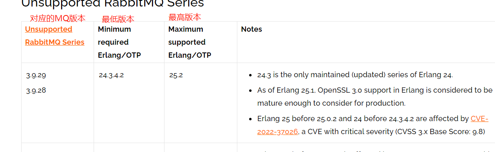

### 目录
* [setp1. 下载 & 安装 Erlang & RabbitMQ Server]()
    * [1.1 确认 RabbitMQ Server 对应的 Erlang 版本号]()
    * [1.2 下载 & 安装 Erlang]()
        * [1.2.1 通过RPM包安装]()
        * [1.2.2 通过精简版的RPM包安装]()
    * [1.3 下载 & 安装 RabbiteMQ Server]()
        * [1.3.1 通过RPM包安装]()
* [setp2. 启用 Management (WEB管理界面)]()

### 系统环境
```
System: Centos7 
```


### setp1. 下载 & 安装 Erlang & RabbitMQ Server
#### 1.1 确认 RabbitMQ Server 对应的 ERlang 版本号
[查看对应版本](which-erlang)




[which-erlang]: https://rabbitmq.com/which-erlang.html

#### 1.2 下载Erlang


##### 1.2.1 通过RPM包安装
[到 PackageCloud 下载对应版本的RPM包](https://packagecloud.io/rabbitmq/erlang/?filter=rpms)

[到官网下载 erlang]()

```
# 下载
wget -O erlang-rpm https://packagecloud.io/rabbitmq/erlang/packages/el/7/erlang-23.2.7-2.el7.x86_64.rpm/download.rpm?distro_version_id=140

# 解压
rpm -Uvh erlang-rpm

# 安装
yum install -y erlang
```

##### 1.2.2 通过精简版的RPM包安装
[erlang-rpm/releases](https://github.com/rabbitmq/erlang-rpm/releases)

该报剥离了对于RabbitMQ不重要的模块和依赖. 下载 & 安装 方式跟 [1.2.1](#121-通过rpm包安装) 一样


#### 1.3 下载 & 安装 RabbiteMQ Server

##### 1.3.1 通过RPM包安装
[到 PackageCloud 下载对应版本的RPM包](https://packagecloud.io/rabbitmq/rabbitmq-server?filter=rpms)
[到 Github 下载对应的发行版](https://github.com/rabbitmq/rabbitmq-server/releases/tag/v3.12.2)

```
# 安装依赖
yum install -y socat

# 下载
wget http://github.com//rabbitmq/rabbitmq-server/releases/download/v3.9.15/rabbitmq-server-3.9.15-1.el7.noarch.rpm

# 解压
rpm -Uvh rabbitmq-server-3.9.15-1.el7.noarch.rpm

# 安装
yum install -y rabbitmq-server
```

### setp2. 启用 Management (WEB管理界面)
```
# 启用
rabbitmq-plugins enable rabbitmq_management

# 创建用户
rabbitmqctl add_user 'your_user' 'your_password_of_user'

# 设置tags
rabbitmqctl set_user_tags 'your_user' management
# management 之外还有其他几个标签, rabbitmq_management专有
# 具体看链接 https://www.rabbitmq.com/management.html#permissions
```


[which-erlang](https://www.rabbitmq.com/which-erlang.html)