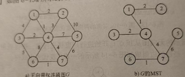

# Spanning Tree of a graph (图的生成树).
CreateAt: The 11th March, 2025

- [Spanning Tree of a graph (图的生成树).](#spanning-tree-of-a-graph-图的生成树)
  - [脑图](#脑图)
  - [生成树的定义](#生成树的定义)
  - [最小代价生成树的定义](#最小代价生成树的定义)
    - [常见算法](#常见算法)
      - [无向带权连通图的最小生成树算法](#无向带权连通图的最小生成树算法)
    - [示例](#示例)

## 脑图

## 生成树的定义
将图转成树, 这棵树通常被叫做生成树.  
设G=(V,E)是一个连通的无向图, 包含图中全部顶点的`极小连通子图`可以被称作图的生成树.  

极限连通子图的条件
1.  包含图中全部顶点
2.  在图连通的前提下边最少
3.  不存在回路

通过深度优先搜索算法得到的生成树叫做深度优先生成树, 广度优先搜索也一样得到的是广度优先生成树.   
特点:
1.  同一个图使用相同的遍历方式得到的生成树并不一定唯一.
2.  转成生成树后一定会符合树的条件, 即边的数量一定是n-1条, n是顶点数. 
    `少于n-1图肯定不连通; 多于这个值, 图必定存在回路, 也不符合树的条件`

一个图的所有连通分量(>1), 生成的生成树组, 可称作图的生成森林

## 最小代价生成树的定义
假设:带权图的每条边都有权值.  又因一个图的连通图产生的生成树可能有多个. 虽然它们的边数和顶点数是一样的, 但是对于生成树中所有边的权值之和, 不一定相同. 其中权值之和最小的生成树就是最小代价生成树(Minimum-cost Spanning Tree, MST).

最小生成树边的集合满足以下条件
1.  边集合中所有边的权之和为所有满足条件的其他边集合中最小.
2.  边集合中的边能保证图是连通的.

最小生成树的性质:
1.  它含有图G的所有n个顶点
2.  它没有回路
3.  它含有的边数为n-1
4.  去掉最小生成树的一条边, 换上不在最小生成树中的另外一条边, 在仍要求连通的前提下, 所得的权值总和都不会小于原最小生成树的权值总和.

### 常见算法
#### 无向带权连通图的最小生成树算法
1.  普里姆算法
2.  克鲁斯卡尔算法

### 示例

