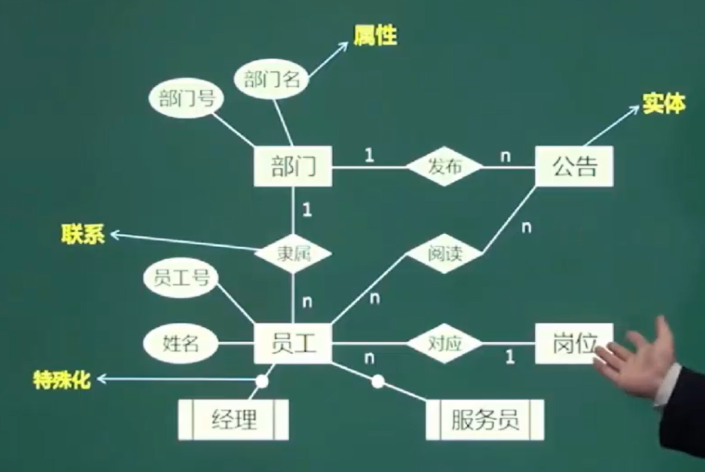

# Entity-Relationship Model (E-R模型)

## E-R模型是什么？
E-R模型（Entity-Relationship Model）是一种用于数据库设计的概念模型。它提供了一种描述现实世界中数据组织和关联的图形化方法，用于表示实体、属性和联系之间的关系。

## 相关概念
### 实体 (Entity)
实体表示现实世界中的一个独立对象, 可以是人、物、地点、概念等. 实体用`矩形框`表示. 
#### 弱实体
某个实体须依赖另实体, 该实体才成立. 我们称为弱实体. 举例:员工实体,在其基础上特殊化一个`弱实体经理`. 该弱实体即使员工也是经理.
弱实体通常用`双矩形`表示

### 属性 (Attrbute)
描述实体的特征信息. 每个实体可以有多个属性, 列如一个人实体有姓名、年龄、性别等属性. 属性以`椭圆形状`表示, 并与实体相连.
`其中能唯一标识实体的属性成为主键`

### 联系 (Relationship)
`联系还可以具有属性`
表示实体与实体之间的关系. 关于可以是1:1, 1:n, n:m. 联系用`棱形`表示, 并与相关实体相连.   
#### 内部关系
#### 外部关系

### 扩展
#### 特殊化
#### 聚集
聚集是将N个实体以及关系视为一个`更高级的实体`. 表示方法通常为:用一个包围关系和参与实体的矩形来表示。这个新的矩形可以作为一个单一的单元参与其他关系。  
例子:考虑一个项目管理系统：
实体：员工、项目、部门
关系：员工参与项目
聚集：将"员工参与项目"这个关系聚集起来，然后与"工作时间"关联

