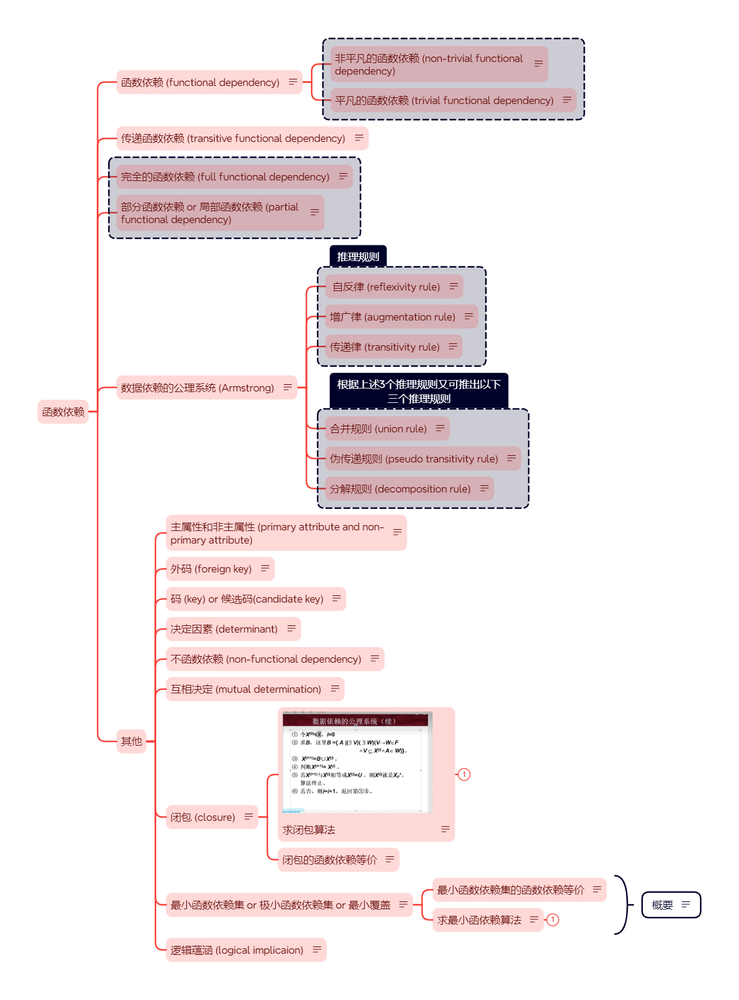

# 函数依赖相关概念
## 目录
- [函数依赖相关概念](#函数依赖相关概念)
  - [目录](#目录)
    - [函数依赖 (functional dependency)](#函数依赖-functional-dependency)
      - [平凡函数依赖 (trivial functional dependency)](#平凡函数依赖-trivial-functional-dependency)
      - [非平凡函数依赖 (non-trivial functional dependency)](#非平凡函数依赖-non-trivial-functional-dependency)
    - [完全函数依赖 (full functional dependency)](#完全函数依赖-full-functional-dependency)
    - [部分函数依赖 or 局部函数依赖 (partail functional dependency)](#部分函数依赖-or-局部函数依赖-partail-functional-dependency)
    - [传递函数依赖 (transitive functional dependency)](#传递函数依赖-transitive-functional-dependency)
  - [数据依赖的公理系统 (Armstrong)](#数据依赖的公理系统-armstrong)
      - [自反律 (reflexivity rule)](#自反律-reflexivity-rule)
      - [增广律 (augmentation rule)](#增广律-augmentation-rule)
      - [传递律 (transitivity rule)](#传递律-transitivity-rule)
      - [合并规则 (union rule)](#合并规则-union-rule)
      - [伪传递规则 (pseudo transitivity rule)](#伪传递规则-pseudo-transitivity-rule)
      - [分解规则 (decomposition rule)](#分解规则-decomposition-rule)
  - [其他](#其他)
      - [主属性和非主属性 (primary attribute and non-primary attribute)](#主属性和非主属性-primary-attribute-and-non-primary-attribute)
      - [外码 (foreign key)](#外码-foreign-key)
      - [码 (key) or 候选码(candidate key)](#码-key-or-候选码candidate-key)
      - [不函数依赖 (non-functional dependency)](#不函数依赖-non-functional-dependency)
      - [互相决定 (mutual determination)](#互相决定-mutual-determination)
      - [决定因素 (determinant)](#决定因素-determinant)
      - [逻辑蕴涵 (logical implication)](#逻辑蕴涵-logical-implication)
      - [闭包 (closure)](#闭包-closure)
      - [最小函数依赖集 or 极小函数依赖集 or 最小覆盖](#最小函数依赖集-or-极小函数依赖集-or-最小覆盖)
      - [最小函数和闭包关系](#最小函数和闭包关系)

### 函数依赖 (functional dependency)
-   定义:设R(U)是属性集U上的关系模式，X、Y是U的子集。若对R(U)的**任何一个可能的关系r**，**r中不可能存在两个元组在X上的属性值相等，而在Y上的属性值不等**，则称X函数决定Y或Y函数依赖于X，记作X->Y
#### 平凡函数依赖 (trivial functional dependency)
-   定义  
    如果 **X->Y,但Y⊆X**则称为X->Y是平凡的函数依赖.
-   例子  
    (Sno, Cno) -> Sno/ Cno 通过(Sno, Cno)组合键确定了Sno或Cno，Sno和Cno都是X集合的组成部分。
#### 非平凡函数依赖 (non-trivial functional dependency)
`note:一般情况下，总是讨论非平凡函数依赖`
-   定义  
    如果**X->Y,但Y⊈X**则称为X->Y是非平凡的函数依赖. 
-   例子  
    (Sno, Cno) -> Grade 通过(Sno, Cno)组合键确定了Grade，且它们没有任何关系

### 完全函数依赖 (full functional dependency)
-   定义  
    在R(U)中，如果X->Y, **并且对于X的任何一个真子集X'，都有X'!->Y**，则称为Y对X完全函数依赖， 记作 $X\stackrel{f}{\longrightarrow}Y$
-   例子  
    有SC(Sno,Cno,Grade)表，可由 $(Sno, Gno)\stackrel{f}{\longrightarrow}Grade$,但是若将(Sno，Gno)拆散则无法确定Grade。即Grade是完全依赖于 (Sno，Gno)这个整体。 

### 部分函数依赖 or 局部函数依赖 (partail functional dependency)
-   定义  
    若X->Y,但Y不完全函数依赖于X，则称Y对X部分函数依赖，记作 $X\stackrel{p}{\longrightarrow}Y$. 
    -   大白话  
        决定Y的只是X中的某个元素，只要拿到该元素就可以确定Y，其他元素都可排除。 所以它只和X中某个部分产生了依赖

### 传递函数依赖 (transitive functional dependency)
-   定义  
    在R(U)中，如果X->Y(Y⊈X 且 $Y{\nrightarrow}X$)，Y->Z(Z⊈Y), 则称Z对X传递函数依赖，记作$X\stackrel{传递}{\longrightarrow}Z$

## 数据依赖的公理系统 (Armstrong)
`一套推理规则`
#### 自反律 (reflexivity rule)
-   定义:若 Y ⊆ X ⊆ U, 则X->Y为F所蕴涵
#### 增广律 (augmentation rule)
-   定义: 若 X->Y为F所蕴涵，且Z⊆U，则XZ->YZ为F所蕴涵
#### 传递律 (transitivity rule)
-   定义: 若X->Y及Y->Z为F所蕴涵，则X->Z为F所蕴涵。
#### 合并规则 (union rule)
-   定义:由 X->Y, X->Z，有X->YZ
#### 伪传递规则 (pseudo transitivity rule)
-   定义:由X->Y, WY->Z，有XW->Z
#### 分解规则 (decomposition rule)
-   定义:由X->Y及Z⊆Y，有X->Z
## 其他
#### 主属性和非主属性 (primary attribute and non-primary attribute)
-   定义  
    包含在任何一个候选码中的属性称为主属性，否则称为非主属性
#### 外码 (foreign key)
-   定义  
    若R(U)中的属性或属性组X非R的码，但X是另一个关系的码，则称X外码(候选键)。
    -   大白话:R表中X属性非R表中的码，而是另一个表的，则称为外码
#### 码 (key) or 候选码(candidate key)
-   定义  
    设K为R(U,F)中属性组合，若X->U,且K的任何一个真子集K‘都不能推出U，则J为R的码(候选码)。
#### 不函数依赖 (non-functional dependency)
-   定义:若Y不函数依赖于X，则记作$X{\nrightarrow}Y$
#### 互相决定 (mutual determination)
-   定义:若X->Y，Y->X, 则记作$X{\longleftrightarrow}Y$
#### 决定因素 (determinant)
-   定义:若X->Y,则称X为这个函数依赖的决定因素
#### 逻辑蕴涵 (logical implication)
-   定义:  
    对于满足一组函数依赖F的关系模式R<U,F>,其任意一个关系r，若函数依赖X->Y都成立(即r中任意两元组t、s，若t[X]=s[X]，则t[Y]=s[Y]),则称F逻辑蕴涵X->Y.
    -   大白话:  
        X->Y 且明确了F，取任意两行t,s 它们的X->Y都相等。 即t[x]=s[x] 且 t[y]=t[y]
#### 闭包 (closure)
-   定义  
    在关系模式`R<U,F>`中为F(F是函数依赖)所逻辑蕴涵的函数依赖全体叫做F的闭包, 记作 $F+$
    -   大白话  
        F+=F中显式写出的函数依赖和隐式(使用规则推理出来的)的函数依赖
        -   例
            U={ABCDE}，F={A->B, B->C, D->E}
            F+=A->B, B->C, D->E和A->C
-   注意
    1.  有时会写成$A\scriptstyle F+$，表示由A能推出来的所有函数依赖(显式和隐式)。
    -   例
        U={ABCDE}，F={A->B, B->C, D->E}  
        $A\scriptstyle F+$= A->B, B->C 和 A->C = {B,C}
    1.  一般闭包集合只保留X->Y形式中的Y且不重复
-   相关概念
    -   闭包的函数依赖等价
        - 定义:如果 G+=F+，就说函数依赖集F覆盖G(F是G的覆盖，或G是F的覆盖)，或F与G等价。(概括:两个函数依赖集等价指的是它们闭包等价)
-   求闭包算法  
    整个过程实际是一个迭代过程,只需要注意它的停止条件即可. 算法输入X,F 输出$X\scriptstyle F+$
    -   停止条件:若$X^{(i+1)}$ == $X^{i}$ 或 $X^N$ = U 
    -   计算过程
        有 `U={A,B,C,D,E}` `F={AB->C,B->D,C->E,EC->B,AC->B}` 求$(AB)\scriptstyle F+$
        1.  $X^{0}=AB$
        2.  $X^{1}=X^{0}+CD=ABCD$  
        根据F集合可知,$X^{0}$可推出AB->C和B->D,故加在后面. 且$X^{1}$不符合任意停止条件,继续迭代
        3.  $X^{2}=X^{1}+CDEB=ABCDE=u$  
        AB->C,B->D,C->E,AC->B. $X^2=U$符合停止条件.
        4.  ∴$(AB)\scriptstyle F+$ = U = ABCDE
#### 最小函数依赖集 or 极小函数依赖集 or 最小覆盖
`从结果集合上来看它与闭包相反，闭包包含显示和隐式的关系，而最小函数依赖则是能省则省。`
-   如果函数依赖集F满足下列条件，则称F为一个极小函数依赖集，亦称为最小依赖集或最小覆盖。
    1.  F中任一函数依赖右部仅含有一个属性。(大白话:不能有 A->BC, 得拆 A->B, A->C)
    2.  F中不存在这样的函数依赖X->A, 使得F与F-{X->A}等价。(大白话: 不得有废话. 即函数依赖中某个显示依赖，删掉或没删掉都不会影响，F(删前) = F(删后)； 即 F={A->B, B->C, A->C}, 其中A->C就是多余的，不能有)
    3.  F中不存在这样的函数依赖X->A, X有真子集Z使得F-{X->A}∪{Z->A}与F等价。(大白话:若函数依赖中存在 {AB->C, A->C} 只留 A->C)
    4.  记作 Fmin
-   求最小函依赖算法
    -   计算过程
        1.  第一步 简化右边 有X->Y，F中还有其他关系能推出Y或Y的子集，则需将Y拆解。即 X->Y1 X->Y2 (Y1和Y2都是Y的子集)
        2.  第二步 去除冗余并求闭包算法验证，需将F所有元素都遍历一遍。  
            逐一尝试删除F中的某元素G(X->Y形式)并在P=F-G集合中求(X)F+的闭包。若闭包集合中包含Y则多余，否则不多于。
        3.  第三步 简化左边 若X->Y，X的子集X1->Y成立，则仅保留X1->Y. X->Y即多余可删除。

-   相关概念
    -   最小函数依赖集的函数依赖等价
        -   定义:每个函数依赖F均等价于一个最小函数依赖集 Fm. 此Fm称为最小依赖集
#### 最小函数和闭包关系
1.  实际上 Fmin是基于F的简写版 (删除了废话)
2.  F+是F的完全版 (写出了显式和隐式关系)
3.  它们都是基于F得来的
4.  所以它们 Fmin = F = F+