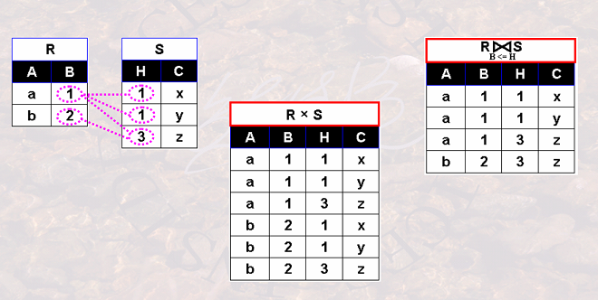

# 关系代数的基本定义
-   目录
    -   [集合运算](#集合运算)
        -   [并 (Union)](#并-union)
        -   [交 (Intersection)](#交-intersection)
        -   [差 (Difference)](#差-difference)
        -   [笛卡尔积 (Cartesian Product)](#笛卡尔积-cartesian-product)
            -   [广义笛卡尔积 (Generalized Cartesian Product)](#广义笛卡尔积-generalized-cartesian-product)
    -   [专门关系运算](#专门关系运算)
        -   [选择 (Selection)](#选择-selection---水平运算)
        -   [投影 (Projection)](#投影-projection---垂直运算)
        -   [连接](#连接-join)
            -   [自然连接](#自然连接)
            -   [θ(西塔)连接](#θ西塔连接)
                -   [等值连接](#等值连接)
        -   [外连接 (Outer Jion)](#外连接-outer-jion)
            -   [左连接 (Left Outer Jion)](#左连接-left-outer-jion)
            -   [左连接 (Right Outer Jion)](#右连接-right-outer-jion)
            -   [左连接 (Full Outer Jion)](#全外连接-full-outer-jion)
        -   [除法 (Division)](#除法-division)
            -   象集
    -   [其他](#其他)
        -   [关系的性能判定标准](#关系的性能判定标准)
    -   [参考](#参考)

## 集合运算
`note: 集合运算除了使用前提外,定义和数学集合中基本一致.`
### 并 (Union) 
-   定义:`RUS={t|t∈R或t∈S}` R,S为结构相同的两表.
-   例子:`A={1，2，3}  B={2，3，4}  A∪B = {1，2，3，4}`
### 交 (Intersection)
-   定义:`R∩S={t|t∈R且T∈S}` R,S为结构相同的两表.
-   例子:`A={1，2，3}  B={2，3，4}  A∩B = {2，3}`
### 差 (Difference)
-   定义:`R-S={t|t∈R且t∉S}`, R,S为结构相同的两表.
-   例子:`A={1,2,3,4,5} B={3,4,5,6} A-B={1,2}`
### 笛卡尔积 (Cartesian Product)
-   定义:`R*S={t|t=<tn, tm> tn∈R且tm∈S}`, <tn, tm>=元组tn和元组tm拼接的新元组.将两个集合的每个元素按照所有可能的组合方式配对,生成一个新的集合.
-   例子:`A = {a,b} B={1,2}  A*B={(a,1), (a,2), (b,1), (b,2)}`
-   推广
    #### 广义笛卡尔积 (Generalized Cartesian Product)
    -   定义:笛卡尔积的基础上的推广,即当笛卡尔积涉及的集合不止两个时，就是广义笛卡尔积. 
        `注意:(另一种定义则说广义笛卡尔积是在笛卡尔积时加入筛选条件.但个人感觉这是不对的,因为这跟自然连接中的'θ连接'一样.)`
    -   例子:`A = {a, b}  B = {1, 2}  C = {x, y} A*B*C={(a,1,x),(a,1,y),(a,2,x),(a,2,y),(b,1,x),(b,1,y),(b,2,x),(b,2,y)}`

## 专门关系运算
### 选择 (Selection) - 水平运算
-   定义:按照运算规则从关系中水平方向取得诸元组。`σF(R)={t|t∈且F(A)=true}`,F是运算条件可以是常数、运算符、计算比较符、逻辑运算符;,A是关系R中的属性。
-   例子:`σ1>6(R) = 从表R中取出字段1>字段6的数据`
### 投影 (Projection) - 垂直运算
-   定义:从关系中获得仅包含指定属性的诸元组.`ΠA(R)={t[A]|t∈R}`, A是指定的属性.
-   例子:Π1,2,3(R) = 从关系R中获得仅包含属性1，2，3的诸元组。
-   推广
    #### 广义投影 (Generalized Projection)
    -   定义:在投影的基础上增加了算术运算。即：Π字段1，字段2-字段3...字段N(R) 这种形式。
    -   例子:Π1,1×2(R) = 选择诸元组且仅包含1和经过算术运算的1×2意为属性1和属性2的积.

### 连接 (Join)
`note:在笛卡尔积基础上做的运算.故而笛卡尔积又可被称为无条件连接,以下连接又被称为有条件连接.`
-   #### 自然连接
    -   定义:
        -   该操作会对水平和垂直方向进行运算。垂直方向会将两表中的属性进行合并(多个相同属性只保留第一个)；水平方向会以两表中相同的属性作为筛选条件，选出相同属性的诸元组.
        -   `R ⋈ S = {t|t=<tn,tm>且tn∈R且tm∈S且R.B1=S.B1且R.B2=S.B2……且R.BK=S.BK}` `R.B1=S.B1且R.B2=S.B2……且R.BK=S.BK` 这部分为筛选条件, 两集合中最少要有一个相同属性.
    -   例子:
    -   注意:如果没有重复属性，那么自然连接就转换为笛卡尔积
-   #### θ(西塔)连接
    -   定义:
        -   θ=任意筛选条件,即对笛卡尔积后的结果进行θ筛选.
        -   `R⋈(XθY)S   = {t|t=<t^n, t^m> 且 t^n∈R 且 t^m∈S 且 t^n[X]θt^m[Y]}` 意为从笛卡尔积中筛选出X和Y满足θ运算的诸元组.
    -   例子:
    -   注意:θ连接中重复属性不一会被删除! 要看θ计算规则.若计算规则包含了重复属性则保留第一个,否则会保留.
    -   扩展
        -   ##### 等值连接
            -   定义:其实就是θ="等于"号. `R⋈(X=Y)S = {t|t=<t^n, t^m> 且 t^n∈R 且 t^m∈S 且 t^n[X]=t^m[Y]}`
### 外连接 (Outer Jion)
`外连接运算是连接运算的扩展，可以处理由于连接运算而缺失的信息。(在连接运算时,选择性保留未找到对应数据的诸元组)`
-   #### 左连接 (Left Outer Jion)
    -   定义:⟕为左连接. 保留左侧所有数据，若该数据与右侧不匹配则右侧属性值为null
-   #### 右连接 (Right Outer Jion)
    -   定义:⟖保留右侧所有数据，若该数据与左侧不匹配则左侧属性值为null
-   #### 全外连接 (Full Outer Jion)
    -   定义:⟗保留左边或右边都无法在对方集合中找到任何匹配项的诸元组，空字段用null表示。即 Left Outer Jion和 Right Outer Jion的合体

### 除法 (Division)
`书本上对它的定义较为抽象,故而用一句话去概括会好理解些.`
-   概括:R中A列那些记录对应的B和C，包含了所有S中的B、C. (结合下图) 
-   相关概念
    -   象集
        -   定义:关系R(X,Z), X和Z为属性组。当t[X]=x时，x在R中的象集为 Zx={t[Z]|t∈R， t[X]=x} 大白话：象集就是对一个集合中元素进行筛选过后的新集合。Zx中的x表示筛选条件 Z表要的结果属性组；t[Z]表筛选结果的具体值；t[X]=x表筛选条件
        -   例子:在关系R(X,Z)中，X可取3个值 {x1, x2, x3} R<X,Z>={(x1, Z1),(x1, Z2),(x1, Z3),(x2, Z2),(x2, Z3),(x3, Z1),(x3, Z3). 解:x1的象集为 Zx1={Z1, Z2, Z3};x2的象集为 Zx2={Z2, Z3};x3的象集为 Zx3={Z1,Z3}
        -   样子:

## 其他
### 关系的性能判定标准
-   **运算量少则性能高**

## 参考
(参考θ连接图片)[https://blog.csdn.net/Jaihk662/article/details/80069866]