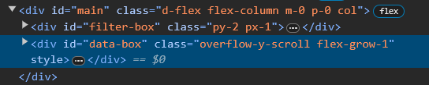
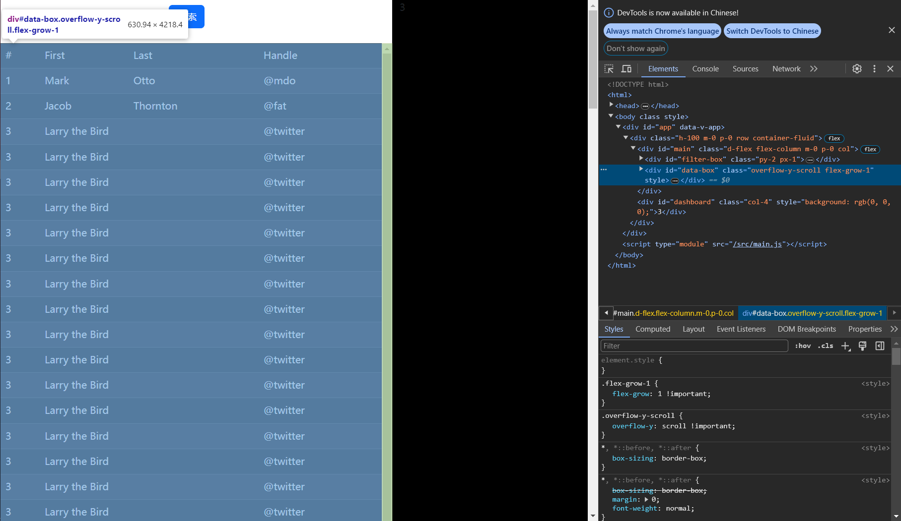
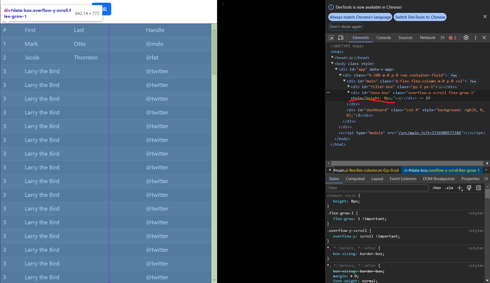

# flex grow 溢出不显示滚动条问题

> LastUpdateTime: The 28nd of May, 2024  

## 目录
- [flex grow 溢出不显示滚动条问题](#flex-grow-溢出不显示滚动条问题)
  - [目录](#目录)
    - [问题](#问题)
      - [结构和样式](#结构和样式)
      - [效果](#效果)
    - [修复方案](#修复方案)
      - [最终效果](#最终效果)

### 问题
可以看到`flex-grow:1`元素溢出时直接导致超过了其祖父元素()`#main的父元素`). 我们希望的是当`flex-grow:1`元素溢出时，能够显示滚动条，而不是直接溢出。
#### 结构和样式

#### 效果
  

### 修复方案
在`#main`元素中将`height:0`即可. (注:因为纵向的所以设置`height`,反正设置`width`).
#### 最终效果
